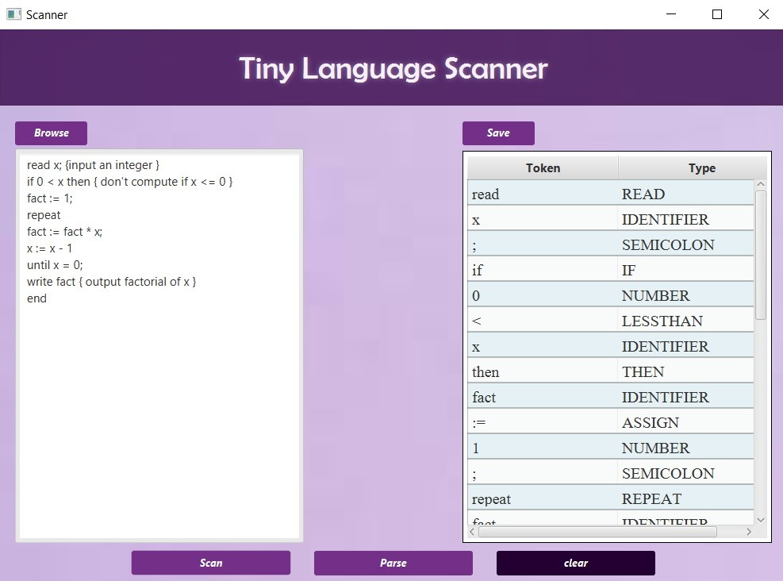
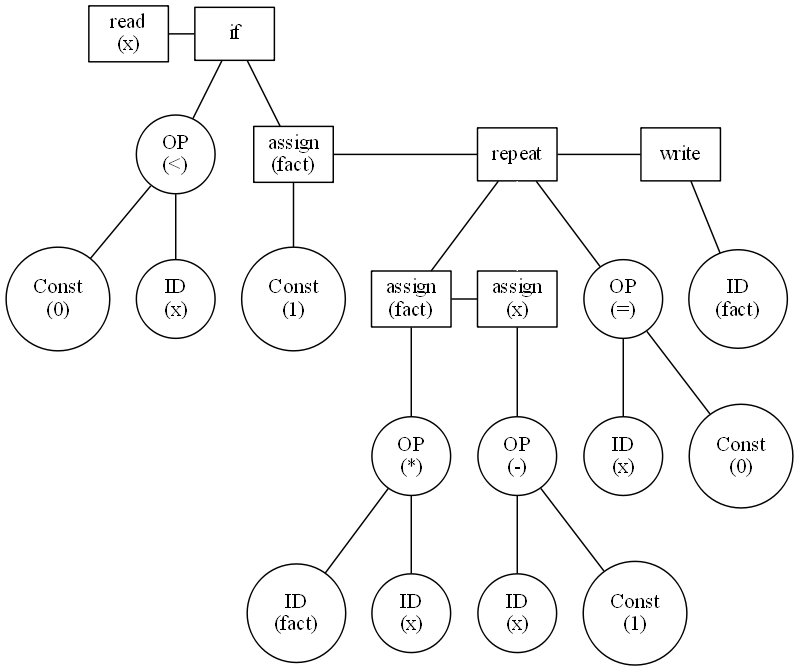

# Parser

## Overview
Welcome to the Scanner & parser project, In the first phase, called the Scanner, we created a tool that reads TINY language code and makes a list of tokens, each with a value and type, saving them to a file.

Now, in the second phase, called the Parser, we've built on the Scanner's work. The Parser goes through the tokens and puts them together to create a syntax tree, showing the structure of the TINY language code.

## Table of Contents

1. [Introduction](#introduction)
2. [Snapshots](#snapshots)
3. [Installation](#installation)
4. [Team Members](#team-members)

---

## Introduction

The Scanner is a crucial component that reads the source code, performing lexical analysis to break it into tokens—the fundamental units of the programming language. This phase involves reading the source code character by character, identifying tokens using regular expressions, and creating corresponding entries in the symbol table for each token. The tokens are then passed to the parser for further processing.

## Snapshots

### Example 1

### Example 2

## Installation
1. Clone the repository.
2. Provide your TINY language snippet in a file.
3. Run the scanner program.
4. Retrieve the output file containing the list of tokens. Additionally, the system now supports parsing capabilities, allowing you to inspect and visualize the syntax tree.

You can download the executable file from [this link](https://drive.google.com/drive/folders/183pajip5B7IxA4wvz-X9Er8iNC1Bs0OT?usp=sharing).

## Team Members

1. **Member 1**
   - **Name:** Abdelrahman Ali Mohamed
   - **ID Code:** 1900913

2. **Member 2**
   - **Name:** Mostafa Mahmoud Ali
   - **ID Code:** 1900034 

3. **Member 3**
   - **Name:** Habiba Ahmed Alaa Eldin Mohamed
   - **ID Code:** 1900839

4. **Member 4**
   - **Name:** Mai Esmail Gamal
   - **ID Code:** 1900171

5. **Member 5**
   - **Name:** Esraa Amr Abdelmoneam
   - **ID Code:** 1900061
6. **Member 6**
   - **Name:** Maram Ahmed Hussien
   - **ID Code:** 1900050